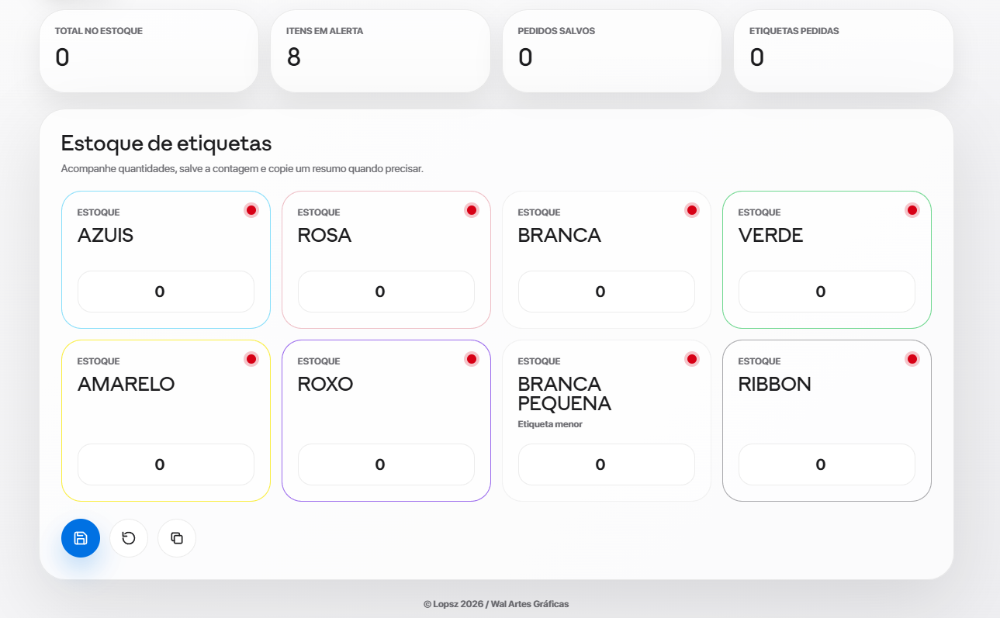

# Daty

Daty é uma aplicação web desenvolvida para gerenciamento de estoque e controle de pedidos de etiquetas. O projeto foi criado para oferecer uma experiência simples, moderna e eficiente, permitindo registrar quantidades em estoque, acompanhar pedidos, gerar relatórios e manter os dados salvos diretamente no navegador.

## Visão geral

O sistema possui uma interface responsiva, com visual moderno inspirado em aplicações desktop, suporte a tema claro e escuro, painel de estatísticas, controle de estoque por tipo de etiqueta e histórico completo de pedidos realizados.

A aplicação foi pensada para facilitar a rotina de controle interno da Wal Artes Gráficas, centralizando informações importantes em uma tela prática e organizada.

## Funcionalidades

- Controle de estoque por tipo de etiqueta
- Indicador de itens com estoque baixo
- Salvamento automático dos dados no navegador com LocalStorage
- Registro manual de pedidos
- Validação de pedidos duplicados por nome
- Histórico organizado de pedidos
- Contagem total de pedidos, etiquetas e itens em estoque
- Exportação de relatório de pedidos em arquivo `.txt`
- Cópia rápida de relatório de estoque
- Alternância entre modo claro e modo escuro
- Relógio em tempo real
- Layout responsivo para desktop e dispositivos móveis

## Tecnologias utilizadas

- HTML5
- CSS3
- JavaScript
- LocalStorage
- Design responsivo

## Licença

Este projeto possui licença proprietária de Lopsz. Consulte o arquivo [LICENSE](LICENSE) para mais detalhes.
